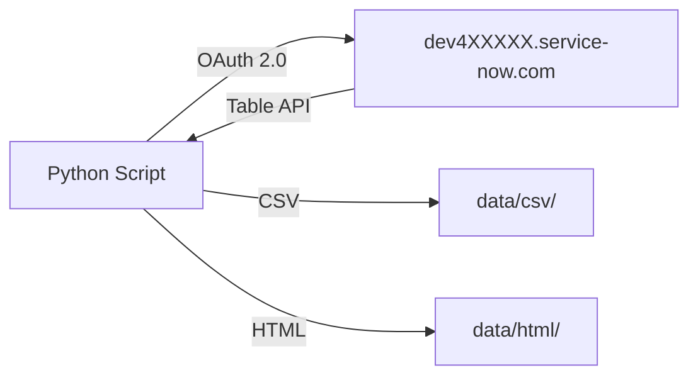

# ServiceNow Incident Management API

> REST API integration scripts for ServiceNow Incident Management — dev instance `dev4XXXXX.service-now.com`

## Overview

8 Python scripts demonstrating the full incident lifecycle via the ServiceNow Table API, authenticated with OAuth 2.0 (password grant type).

## Prerequisites

- Python 3.10+
- ServiceNow developer instance (dev4XXXXX.service-now.com)
- OAuth 2.0 credentials (client ID, client secret, username, password)

## Setup

```bash
pip install -r requirements.txt
cp .env.example .env   # fill in your credentials
```

## Scripts

| # | Script | Description |
|---|--------|-------------|
| 1 | `01_create_incident.py` | Create incidents with category, priority, short description |
| 2 | `02_query_incidents.py` | Query incidents by state, priority, assignment group |
| 3 | `03_assign_incident.py` | Assign incidents to users and groups with work notes |
| 4 | `04_resolve_incident.py` | Resolve and close incidents with resolution notes |
| 5 | `05_sla_monitor.py` | Monitor SLA breach thresholds and flag at-risk records |
| 6 | `06_escalate.py` | Escalate incidents based on time-in-state and priority |
| 7 | `07_batch_report.py` | Export incident data to CSV for Power BI ingestion |
| 8 | `08_dashboard.py` | Generate interactive Plotly HTML dashboard |

## Outputs

- `data/csv/` — exported incident data (sample files included, real data generated by script 7)
- `data/html/` — Plotly dashboard HTML (generated by script 8 when run)

## Data Flow



## Authentication

All scripts load credentials from `.env`:

```python
SN_INSTANCE_URL = https://dev4XXXXX.service-now.com
SN_CLIENT_ID = your_client_id
SN_CLIENT_SECRET = your_client_secret
SN_USERNAME = your_username
SN_PASSWORD = your_password
```
