# Incident Management — Data Flow

```mermaid
graph LR
    User[User / System] -->|Create| SN[ServiceNow dev4XXXXX]
    SN -->|REST API| Script1[01_create_incident.py]
    Script1 -->|sys_id| Script2[02_query_incidents.py]
    Script2 -->|Filtered List| Script3[03_assign_incident.py]
    Script3 -->|Assigned| Script4[04_resolve_incident.py]
    Script4 -->|Closed| Script5[05_sla_monitor.py]
    Script5 -->|Breach Alert| Script6[06_escalate.py]
    Script6 -->|Escalated| Script7[07_batch_report.py]
    Script7 -->|CSV Export| CSV[data/csv/]
    Script7 -->|Data| Script8[08_dashboard.py]
    Script8 -->|HTML| HTML[data/html/]
```



## Module Interactions

- **incident** — core table for all operations
- **sys_user** — assignment group and assigned-to lookups
- **task_sla** — SLA breach tracking
- **sys_audit** — state change history for escalation logic
```
